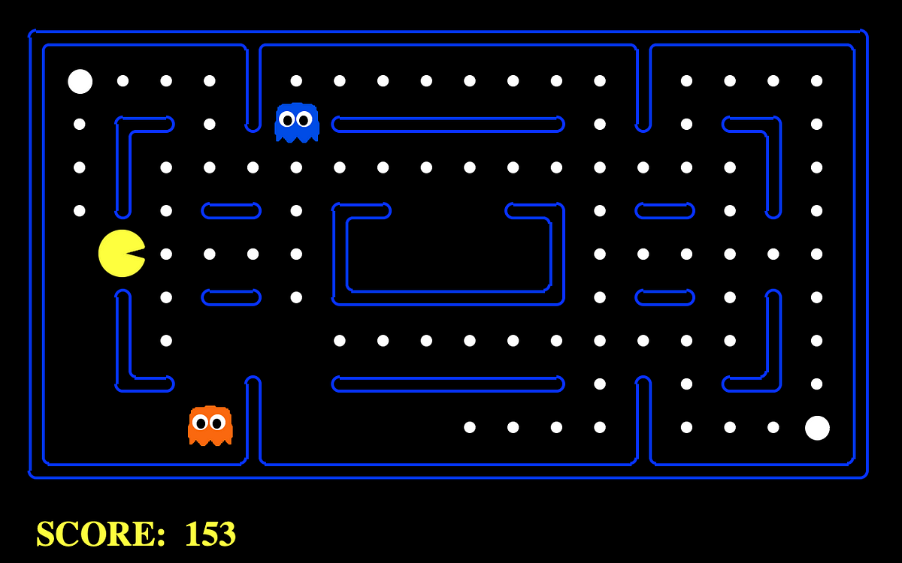

# PacmanAI
<center></center>

### About
- Experience gaming evolution with Autonomous PacBot: a Reinforcement Learning-powered Pacman agent. Watch as it navigates mazes, evades ghosts, and maximizes scores autonomously. Dive into AI-driven gameplay and witness the fusion of classic gaming with cutting-edge technology

### Get Started

- Clone this repo:
```
git clone https://github.com/DavisuaCoder/PacmanAI.git
```

### Any bugs?
- Please kindly to [contact me](https://github.com/DavisuaCoder) or help me to fix the bugs by contributing to this repository. Thank you in advance!

- ## Participants
David Álvarez Perales - [@DavisuaCoder](https://github.com/DavisuaCoder)  
Juan Manuel Fernandez Bustos


